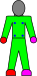
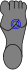
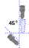
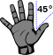
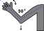
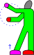
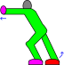
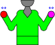
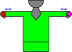

# Tàijíquán (Tai-Chi) 太極拳

**When in doubt consult a physician!**  Do NOT do anything that “hurts” although a SMALL stretching feeling may come with some of the movements.
It is better to only push a little at a time, “pushing harder” will only slow your progress, and could cause injury. If you don't feel anything, thats ok too.

## General “Rules”/Guidelines (feel, don't measure)

*	Do NOT push yourself, Tai-Chi rewards slow but consistent progress.
*	Breath with the movements. This comes with practice, but the rule is Yang-out, Yin-In: see Tor-Yu and Wave hands like clouds to start.
*	In the diagrams, RED is the right side, and LAVENDER is the left. Although only one side is shown, do the same thing on both sides equally.
*	Repetition is key here, these movements can be reversed/looped. Don't overdo it! 5 repetitions 5 times a day is better then 100 times in a row.
*	Yin vs Yang (as listed here, but these are universal terms in Tai-Chi and every instructor should understand them):
    * You can get different things with the same movements (this is slightly advanced, but its important you understand the idea).
    * If you want to be “active” and full of energy,	linger in the Yang side of things,	and phone in the Yin side.
    * If you are trying to “destress” and calm down,	linger on the Yin side of things,	and phone in the Yang side.
    * A balance of both energies is generally better, but... Stressed out, do some Yin... Pressing deadlines, do some Yang.
*	Try to listen to what your body is telling you, and if you gravitate toward one energy that may be your body trying to tell you something.
*	A good thing to try is to do some Yang before work, and some Yin at the end of the day... The hard one, you probably need to do more.

## The 8 “foundation movements” of Tai-Chi
Learning them in order is best

###  Taichi Stance

Bubbling springs directly under arm pits, straight spine, relaxed body, hands at sides with tigers mouth...

Your body should be aligned such that your nipples and hips form a square (Think four of clubs: 4♣).

Your belly button should always be where your weight is.

Try to **breath up not out**, but more importantly keep your spine straight.

A variant to calm down from work: same position, but in a seated position, and breath out from your belly, there should be no movement in your chest or shoulders, again straight vertical spine all the way from neck to chair.

### Bubling Springs

Your weight when not in motion should be on the point shown (the intersection of the meaty parts of your foot).

### Taichi Step

Upon foot placement, your lead foot should be 1 “foot” in front of the other, with the angle between feet a 45° angle to each other.

### Tigers Mouth

Flat palm, thumb at 45° to the pointing finger. When “pushing” you may feel a slight stretch in the hand (You can use a wall).

### Trembling Oak

This can be done sitting or standing: Elbow pointing directly, bent at a 90° angle, arms directly in front of you, rotate the wrist only... palm to you and then away. You can over rotate slightly if you don't feel a stretch, but only do so in moderation. Build up to it at first.

Imagine an iron rod starting at your elbow going through the middle finger. Rotate your hand around this rod, but your elbow & shoulder don't move.

### Tor Yu
'Tare you'

Start with a Tai-Chi step. Imagine you are holding a beach ball. You should be able to lift the front foot. Your body should align with the back foot, keep your spine vertical.

Push up on the back foot, then drop into the front foot.

As you are shifting weight, “throw the ball forward”, rotating your body so that you end up aligned with the front foot.

Push forward with the tigers mouth. You should then be able to lift the back foot.

### Don-Yu
'Down You': no diagram... its just sitting "in a chair"

Start in front of a chair in the Tai-Ch Stance . Sit down, but do so slowly, pushing your butt out, hands pushing forward with a Tigers Mouth.

Try stopping mid way. After a while you get some balance and you will be able to do this without the chair.

After your muscles loosen up, you can complete the movement by slowly going deeper into the sit, until your thighs are parallel to the ground. Do not sit further.

### Wave Hands like Clouds

abbreviated/beginner version

This can be done sitting or standing:

Starting in a Trembling Oak position, palms toward you, with the ends of your fingertips at shoulder height.

Keep your hands at the same shoulder height, and separate your hands, rotating your wrists.

You will end with your arms stretched to your side, thumbs pointing down, palms pointing behind you.

## Interested in joining a group here?

Contact Todd Musheno and we MAY be able to start a group, and you can learn all 108 movements of the full set... as well as other similar arts?

What is listed above should be learned before the full set (Tai-Chi takes time, but is very rewarding), it generally takes about a year to “learn” the basic set.
